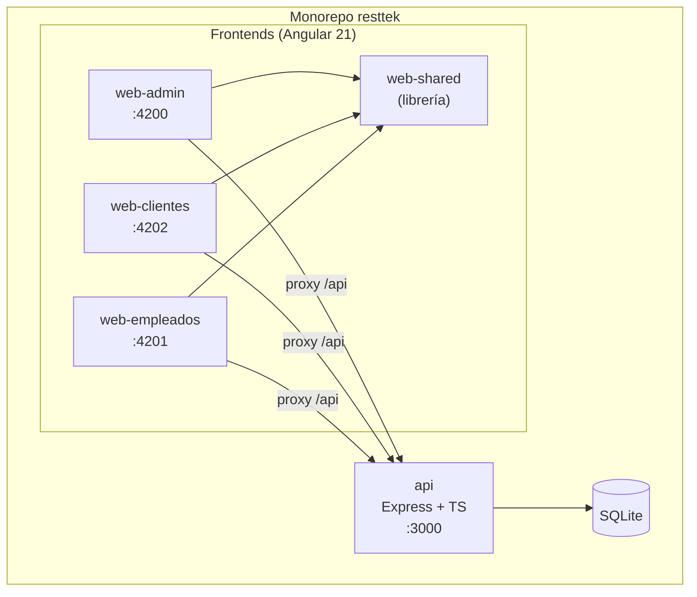
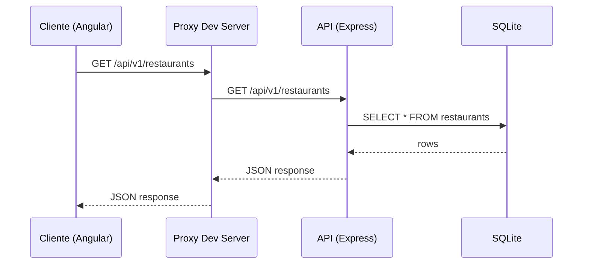
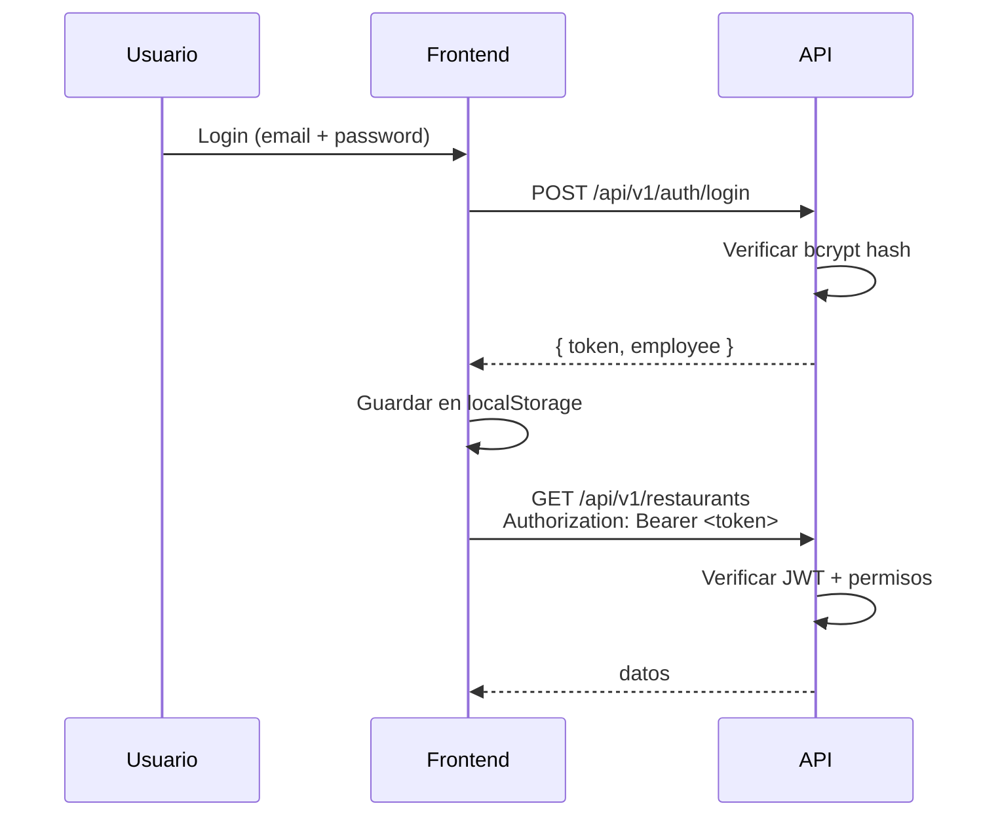
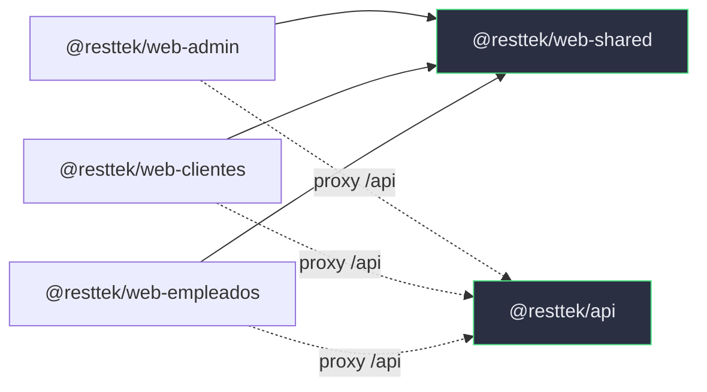

# Arquitectura general

## Visión Macro

Resttek es un **monorepo** gestionado con **npm workspaces** que contiene 5 paquetes: 1 backend Node.js y 4 paquetes Angular (3 aplicaciones + 1 librería compartida).



---

## Estrategia de Monorepo

### npm Workspaces

El `package.json` raíz define todos los paquetes bajo `packages/*`:

```json
{
  "workspaces": ["packages/*"]
}
```

Esto permite:

- **Un solo `npm install`** instala las dependencias de todos los paquetes.
- **Referencias entre paquetes** usando el nombre npm (ej: `@resttek/web-shared`).
- **Scripts centralizados** para arrancar cualquier servicio desde la raíz.

### Scripts Disponibles desde la Raíz

| Comando | Qué hace |
| --- | --- |
| `npm run dev:api` | Arranca la API Node.js con hot-reload (tsx watch) |
| `npm run dev:admin` | Arranca web-admin en :4200 |
| `npm run dev:empleados` | Arranca web-empleados en :4201 |
| `npm run dev:clientes` | Arranca web-clientes en :4202 |
| `npm test` | Ejecuta los tests de la API |
| `npm run seed` | Puebla la base de datos con datos de prueba |

---

## Flujo de Datos



### Proxy de Desarrollo

Cada frontend Angular tiene un `proxy.conf.json` que redirige las peticiones `/api` al backend:

```json
{
  "/api": {
    "target": "http://localhost:3000",
    "secure": false,
    "changeOrigin": true
  }
}
```

Esto elimina problemas de CORS en desarrollo y simula el comportamiento de producción donde frontend y API estarían bajo el mismo dominio.

---

## Separación de Responsabilidades

### Backend

En la API conviven **dos estilos arquitectónicos**:

- **Hexagonal con DDD** en el contexto `employee`: tres capas (Domain → Application → Infrastructure) bajo `src/contexts/employee/`.
- **Por capas** en `restaurant`, `dish`, `ingredient`, `order` y `table`: carpetas transversales `models/`, `repositories/`, `services/`, `controllers/` y `routes/`.

En ambos casos la capa HTTP (controladores y rutas) es un adaptador de entrada y el acceso a datos queda detrás de una interfaz de repositorio. Ver [Arquitectura de la API](./arquitectura-api.md) para detalles.

### Frontend

- **Angular 21** con componentes standalone y signals
- Arquitectura **feature-based**, con matices por aplicación: `web-admin` y `web-empleados` agrupan cada feature en `models/`, `pages/`, `services/` y `store/`; `web-clientes` centraliza modelos y servicios en `core/`
- Librería compartida (`web-shared`) para auth, interceptors y componentes comunes
- Ver [Arquitectura del Frontend](./arquitectura-frontend.md) para detalles

---

## Base de Datos

- **SQLite** como motor de persistencia
- Archivo: `packages/api/resttek.db`
- Las tablas se crean automáticamente al arrancar la API (migraciones en código)
- Con `NODE_ENV=test` se usa SQLite en memoria (`:memory:`)
- Ver [Modelo de Datos](../dominio/modelo-datos.md) para el esquema completo

---

## Autenticación

El sistema usa **JWT (JSON Web Tokens)** para autenticación:



- **Backend**: middleware `authenticate` verifica el JWT; `authorize` comprueba roles.
- **Frontend**: `AuthInterceptor` añade el token a cada petición; `AuthGuard` protege rutas.

---

## Relaciones entre Paquetes



- **`web-shared`** es la única dependencia compartida entre frontends.
- Los frontends **no dependen directamente entre sí**.
- La API no tiene dependencias de los frontends.