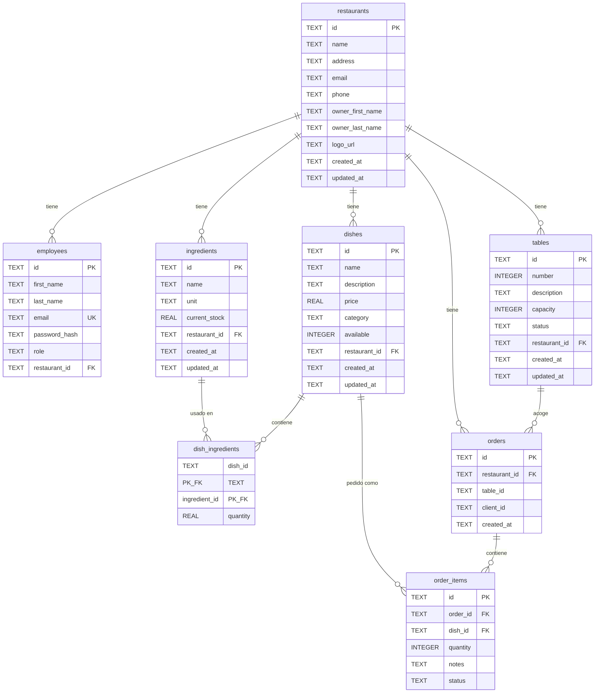

# Modelo de Datos

Esquema de la base de datos SQLite de Resttek.

---

## Diagrama Entidad-Relación

---

## Tablas

### `restaurants`

Almacena la información de los restaurantes.

| Columna | Tipo | Nullable | Descripción |
| --- | --- | --- | --- |
| `id` | TEXT | No | UUID, clave primaria |
| `name` | TEXT | No | Nombre del restaurante |
| `address` | TEXT | No | Dirección |
| `email` | TEXT | No | Email de contacto |
| `phone` | TEXT | No | Teléfono |
| `owner_first_name` | TEXT | No | Nombre del propietario |
| `owner_last_name` | TEXT | No | Apellido del propietario |
| `logo_url` | TEXT | Sí | URL del logo |
| `created_at` | TEXT | No | Fecha de creación (ISO 8601) |
| `updated_at` | TEXT | No | Fecha de última actualización |

---

### `employees`

Almacena **todos** los usuarios del sistema, incluidos los clientes: no hay tabla de clientes aparte. Un cliente es una fila con `role = 'cliente'` y `restaurant_id` a null.

| Columna | Tipo | Nullable | Descripción |
| --- | --- | --- | --- |
| `id` | TEXT | No | UUID, clave primaria |
| `first_name` | TEXT | No | Nombre |
| `last_name` | TEXT | No | Apellido |
| `email` | TEXT | No | Email (único) |
| `password_hash` | TEXT | No | Hash bcrypt de la contraseña |
| `role` | TEXT | No | Rol: admin, manager, camarero, cocinero, cliente |
| `restaurant_id` | TEXT | Sí | FK → `restaurants.id` (null para admin y cliente) |

**Restricciones:**

- `email` es UNIQUE.
- `restaurant_id` es FK a `restaurants.id`.

---

### `ingredients`

Ingredientes disponibles en cada restaurante.

| Columna | Tipo | Nullable | Descripción |
| --- | --- | --- | --- |
| `id` | TEXT | No | UUID, clave primaria |
| `name` | TEXT | No | Nombre del ingrediente |
| `unit` | TEXT | No | Unidad: kg, g, l, ml, unidad |
| `current_stock` | REAL | No | Stock actual (default: 0) |
| `restaurant_id` | TEXT | No | FK → `restaurants.id` |
| `created_at` | TEXT | No | Fecha de creación |
| `updated_at` | TEXT | No | Fecha de última actualización |

---

### `dishes`

Platos de la carta de cada restaurante.

| Columna | Tipo | Nullable | Descripción |
| --- | --- | --- | --- |
| `id` | TEXT | No | UUID, clave primaria |
| `name` | TEXT | No | Nombre del plato |
| `description` | TEXT | Sí | Descripción |
| `price` | REAL | No | Precio en euros |
| `category` | TEXT | No | Categoría: entrante, principal, postre, bebida |
| `available` | INTEGER | No | Disponibilidad: 1 = sí, 0 = no (default: 1) |
| `restaurant_id` | TEXT | No | FK → `restaurants.id` |
| `created_at` | TEXT | No | Fecha de creación |
| `updated_at` | TEXT | No | Fecha de última actualización |

---

### `dish_ingredients`

Relación muchos-a-muchos entre platos e ingredientes.

| Columna | Tipo | Nullable | Descripción |
| --- | --- | --- | --- |
| `dish_id` | TEXT | No | FK → `dishes.id` (PK compuesta) |
| `ingredient_id` | TEXT | No | FK → `ingredients.id` (PK compuesta) |
| `quantity` | REAL | No | Cantidad del ingrediente necesaria |

**Restricciones:**

- PK compuesta: (`dish_id`, `ingredient_id`).
- FK a `dishes.id` **con** `ON DELETE CASCADE`: al borrar un plato desaparecen sus ingredientes asociados.
- FK a `ingredients.id` **sin** cascada.

---

### `tables`

Mesas físicas de cada restaurante.

| Columna | Tipo | Nullable | Descripción |
| --- | --- | --- | --- |
| `id` | TEXT | No | UUID, clave primaria |
| `number` | INTEGER | No | Número de mesa visible para el cliente |
| `description` | TEXT | Sí | Ubicación o nota ("Terraza", "Junto a la ventana") |
| `capacity` | INTEGER | No | Número máximo de comensales |
| `status` | TEXT | No | Estado: libre, ocupada, reservada (default: `libre`) |
| `restaurant_id` | TEXT | No | FK → `restaurants.id` |
| `created_at` | TEXT | No | Fecha de creación |
| `updated_at` | TEXT | No | Fecha de última actualización |

**Restricciones:**

- `UNIQUE(restaurant_id, number)`: el número de mesa es único dentro de un restaurante, pero dos restaurantes pueden tener ambos una "mesa 1".
- FK a `restaurants.id` **sin** cascada.

---

### `orders`

Pedidos de los clientes.

| Columna | Tipo | Nullable | Descripción |
| --- | --- | --- | --- |
| `id` | TEXT | No | UUID, clave primaria |
| `restaurant_id` | TEXT | No | FK → `restaurants.id` |
| `table_id` | TEXT | Sí | `tables.id` de la mesa en la que se hizo el pedido (opcional) |
| `client_id` | TEXT | Sí | ID del cliente (opcional) |
| `created_at` | TEXT | No | Fecha de creación |

**Restricciones:**

- FK a `restaurants.id`.
- `table_id` **no** tiene FK declarada aunque apunte a `tables.id`: la referencia es lógica, no forzada por SQLite. Las lecturas del repositorio hacen `LEFT JOIN tables` para exponer también el `tableNumber`, que es `null` si la mesa no existe o el pedido no tiene mesa.

---

### `order_items`

Líneas de pedido. Cada ítem es un plato con cantidad y estado.

| Columna | Tipo | Nullable | Descripción |
| --- | --- | --- | --- |
| `id` | TEXT | No | UUID, clave primaria |
| `order_id` | TEXT | No | FK → `orders.id` |
| `dish_id` | TEXT | No | FK → `dishes.id` |
| `quantity` | INTEGER | No | Cantidad pedida |
| `notes` | TEXT | Sí | Notas del cliente (ej: "sin gluten") |
| `status` | TEXT | No | Estado: pendiente, preparando, listo, entregado |

**Restricciones:**

- ON DELETE CASCADE desde `orders.id`.

---

## Relaciones

| Relación | Tipo | Descripción |
| --- | --- | --- |
| Restaurant → Employees | 1:N | Un restaurante tiene muchos empleados |
| Restaurant → Ingredients | 1:N | Un restaurante tiene muchos ingredientes |
| Restaurant → Dishes | 1:N | Un restaurante tiene muchos platos |
| Restaurant → Orders | 1:N | Un restaurante tiene muchos pedidos |
| Restaurant → Tables | 1:N | Un restaurante tiene muchas mesas |
| Table → Orders | 1:N | Una mesa acumula varios pedidos |
| Dish ↔ Ingredient | N:M | Un plato usa varios ingredientes (via `dish_ingredients`) |
| Order → OrderItems | 1:N | Un pedido tiene varios ítems |
| Dish → OrderItems | 1:N | Un plato puede estar en varios ítems de pedido |

---

## Notas Técnicas

- **IDs**: Todos son UUID v4 generados con `crypto.randomUUID()`. Excepción: el script de seed usa los identificadores fijos `rest-1` y `rest-2` para los restaurantes de prueba.
- **Fechas**: Almacenadas como TEXT en formato ISO 8601 (`new Date().toISOString()`).
- **Booleanos**: SQLite no tiene tipo BOOLEAN; se usa INTEGER (0 = false, 1 = true).
- **Nomenclatura**: las columnas son `snake_case` y las propiedades TypeScript `camelCase`. La conversión se hace con alias en el propio SQL (`owner_first_name as ownerFirstName`).
- **Migraciones**: Las tablas se crean automáticamente en `Database.initialize()` con `CREATE TABLE IF NOT EXISTS`.
- **Sin migrations framework**: No se usa un sistema de migraciones formal. Los cambios de esquema se hacen modificando `runInitialMigrations()`. Como solo se ejecuta `CREATE TABLE IF NOT EXISTS`, **añadir una columna no afecta a una base de datos ya creada**: hay que borrar `packages/api/resttek.db` y volver a sembrar.